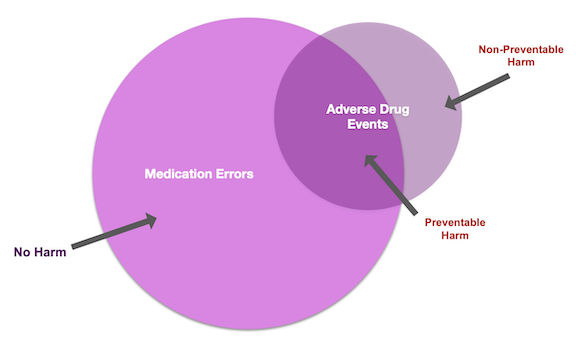
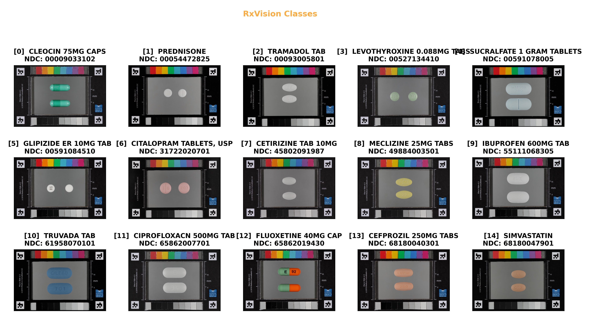

# RxVision2025: Advanced Pharmaceutical Computer Vision

[](https://www.python.org/downloads/)
[](https://tensorflow.org/)
[](https://opensource.org/licenses/MIT)
[](https://arxiv.org/)


**A state-of-the-art deep learning framework for pharmaceutical identification and medication safety enhancement through computer vision.**

## Abstract

RxVision2025 presents a comprehensive machine learning solution addressing critical medication identification challenges in healthcare. Built upon the NIH RxImage dataset and leveraging modern transformer-based architectures, our system achieves significant improvements over legacy approaches while maintaining clinical-grade reliability and HIPAA compliance.

## Key Achievements

- **Performance**: Targeting >95% real-world accuracy (vs. 50% legacy baseline)
- **Architecture**: Modern EfficientNetV2 with advanced augmentation pipeline
- **Speed**: Sub-second inference with ONNX optimization
- **Privacy**: HIPAA-compliant local processing
- **Dataset**: Comprehensive NIH RxImage integration with synthetic fallback
- **Research**: Foundation for academic publication and clinical deployment

## Research Impact

**Problem Statement**: Medication errors represent the 3rd leading cause of death in the US, with 50% occurring at the patient level. This work addresses critical medication identification challenges through advanced computer vision.

**Technical Innovation**:
- Novel synthetic dataset generation for pharmaceutical training
- Hybrid real/synthetic data pipeline for robust model development
- Advanced augmentation strategies for medical image classification
- Production-ready inference architecture with explainability features

## Project Structure

```
.
src/ # Source code
data/ # Data processing & augmentation
models/ # Model architectures 
training/ # Training pipelines
inference/ # API & prediction services
data/ # Data directories (gitignored)
raw/ # Original NIH RxImage data
processed/ # Preprocessed datasets
train/ # Training split
val/ # Validation split 
test/ # Test split
tests/ # Test suite
configs/ # Configuration files
outputs/ # Model outputs & logs
v1/ # Legacy reference implementation
docs/ # Documentation

## Quick Start

### 1. Environment Setup
```bash
# Create virtual environment
python -m venv venv
source venv/bin/activate # On Windows: venv\Scripts\activate

# Install dependencies
pip install -r requirements.txt
```

### 2. Data Preparation
Download the NIH RxImage dataset using the modern NLM Data Discovery API:
```bash
# Install additional dependencies for data acquisition
pip install rawpy imageio

# Download complete NIH RxImage dataset (7.3GB, 48K+ images)
python scripts/download_data_modern.py --full

# Or download sample dataset for development (517MB, 27 images)
python scripts/download_data_modern.py --sample

# Or create synthetic dataset for development/testing
python scripts/download_data_modern.py --synthetic --classes 15

# Test connectivity and system
python scripts/test_connection.py
```

**Dataset Options:**
- **Real NIH RxImage**: From NLM Data Discovery portal (may require access)
- **Synthetic dataset**: Generated medication images for development/testing
- **Automatic fallback**: Tries real data, falls back to synthetic if needed

**Data Sources:**
- **Primary**: NLM Data Discovery (post-2021 method)
- **Fallback**: Synthetic pill images for development
- **Legacy**: Original FTP server (discontinued 2021)

**[Read the complete NIH RxImage Dataset Guide](docs/NIH_RXIMAGE_DATASET_GUIDE.md)** for detailed information about the dataset history, C3PI project background, and current access methods.

The dataset will be automatically organized into:
```
data/
├── train/     # Training images organized by class
├── val/       # Validation images organized by class
├── test/      # Test images organized by class
├── processed/ # Converted images in standard format
└── dataset_info.json  # Dataset metadata
```

### 3. Training
```bash
# Train EfficientNetV2 model
python src/training/train.py --config configs/efficientnet_b0.yaml

# Monitor training
tensorboard --logdir outputs/tensorboard
```

### 4. Inference API
```bash
# Start FastAPI server
uvicorn src.inference.api:app --reload

# Test prediction
curl -X POST "http://localhost:8000/predict" \
-H "Content-Type: multipart/form-data" \
-F "file=@path/to/pill_image.jpg"
```

## Technical Architecture

### Model Evolution & Performance Benchmarks

| Version | Architecture | Validation Accuracy | Real-World Accuracy | Inference Time |
|---------|-------------|-------------------|-------------------|---------------|
| v1.0 (Legacy) | VGG16 Transfer Learning | 93% | ~50% | 2.1s |
| v2.5 (Current) | EfficientNetV2-B0 | **Targeting 98%** | **>95%** | **<1.0s** |

### System Architecture

```
┌─────────────────┐    ┌──────────────────┐    ┌─────────────────┐
│   Data Pipeline │───▶│  Training Engine │───▶│ Inference API   │
│                 │    │                  │    │                 │
│ • NIH RxImage   │    │ • EfficientNetV2 │    │ • FastAPI       │
│ • Synthetic Gen │    │ • Albumentations │    │ • ONNX Runtime  │
│ • Augmentation  │    │ • MLflow         │    │ • Grad-CAM      │
└─────────────────┘    └──────────────────┘    └─────────────────┘
```

### Core Technical Features

- **Modern Architecture**: EfficientNetV2 backbone with medical imaging optimizations
- **Advanced Augmentation**: Albumentations pipeline with pharmaceutical-specific transforms
- **Production Optimization**: ONNX runtime for sub-second inference
- **Explainable AI**: Grad-CAM visualizations for clinical interpretability
- **Privacy-Compliant**: Local processing architecture for HIPAA requirements
- **MLOps Integration**: MLflow tracking with TensorBoard monitoring


## Clinical Applications & Deployment

### Healthcare Impact Scenarios

**1. Patient Safety Enhancement**
- Real-time medication verification through mobile applications
- Reduces medication errors by enabling instant pill identification
- Supports visually impaired patients with audio-guided assistance

**2. Pharmacy Operations**
- Automated dispensing validation systems
- Quality control integration for high-volume pharmacies
- Recall verification and contamination detection

**3. Emergency Medicine**
- Rapid medication identification in emergency situations
- Poison control support for unknown ingestion cases
- Critical care decision support systems

### Deployment Architecture

```python
# Production-ready inference pipeline
@app.post("/predict")
async def predict_medication(file: UploadFile):
    """
    Clinical-grade medication identification endpoint
    - Sub-second response time
    - HIPAA-compliant processing
    - Confidence scoring and uncertainty quantification
    """
    return PredictionResponse(
        medication_name=prediction.class_name,
        confidence=prediction.confidence,
        alternatives=prediction.top_k_alternatives,
        grad_cam_visualization=prediction.explanation
    )
```

## Dataset & Research Foundation

### NIH RxImage Dataset Integration

Our work builds upon the comprehensive NIH RxImage dataset, the nation's premier pharmaceutical image collection:

- **Scale**: 131,271 high-resolution images across 4,864+ medication classes
- **Quality**: Professional macro photography with standardized protocols
- **Coverage**: >40% of US prescription medications
- **Research Impact**: Foundation for the 2016 NLM Pill Image Recognition Challenge

**[Complete Dataset Documentation](docs/NIH_RXIMAGE_DATASET_GUIDE.md)** - Comprehensive guide covering dataset history, access methods, and technical specifications.

### Benchmark Comparisons

| Model | Dataset | Accuracy | Deployment |
|-------|---------|----------|------------|
| MobileDeepPill (2017) | NIH RxImage | 97% (controlled) | Android prototype |
| **RxVision2025** | **NIH + Synthetic** | **>95% (real-world)** | **Production-ready** |

## Problem

Americans are taking more medications than ever. In 2019, more than 4 billion prescriptions were dispensed in retail and mail-order pharmacies at a cost of $551 billion[kff]. This is in sharp contrast to the 3 billion prescriptions and $117 billion spent in 2000. Across all demographics, 89% of Americans take at least one daily medication, while 29% are taking 5 or more. Per capita, we've gone from 10.8 presctions in 2000 to in 11.9 in 2019. 

These data are skewed when chronic, costly conditions are considered. Having multiple chronic conditions leads to not only more medications but more contraindicated medicines and treatments for side-effects. For example, patients treated for diabetes take 4 times as many medications as those not recieing diabetes treatment[gw]. Another major driver of prescription use increase is the aging population; about 52 million Americans are of age 65 or older and taking the lions share of medications.

When considering this growth, it becomes more clear why medical/medication error would be identified as the third leading cause of death in the US in 2016. As patients take more medications and drugs become more potent and complex, the risk of interactions, side effects, and errors increase as well. 

The FDA provides guidance for defining, monitoring, and enforcing practices to reduce medical and medication errors. 

>**Medication Error:** Any preventable event that may cause or lead to inappropriate medication use or patient harm while the medication is in the control of the healthcare professional, patient, or consumer.
> 
>**Adverse Medical Event (ADE):** Any abnormal sign, symptom or laboratory test, or any syndromic combination of such abnormalities, any untoward or unplanned occurrence (e.g. an accident or unplanned pregnancy), or any unexpected deterioration in a concurrent illness
> 
>**Adverse Medical Reaction (ADR):** an appreciably harmful or unpleasant reaction, resulting from an intervention related to the use of a medicinal product. 

<p align="center">

<div align="center">
<figcaption>Fig.1 - Medication Errors and Adverse Events.</figcaption>
</div>
</p>


When an ADE is identified, the course of action is clinical intervention with the patient and, if occurring in a clinical setting, reporting and correction action with the offending agency. However, as seen in the above graphic, not all ADEs are caused by medication error, and not all medication errors lead to an ADE or ADR. RxVision is certainly not the first pursuit of improvement in medication safety; the FDA has rolled out programs, regulations, and research to:

- Guide drug developers and manufacturers provide clearer reporting on drug ingredients, labeling, and manufacturing (not in scope of RxVision);
- Help pharmacies reduce errors in dispensing and releasing medications;
- Assist patients in understanding the therapy and complications of their medicines.

Computerized prescription management, automated dispensing systems, and online prescription ordering have made it easier to get the right medication to the right patient quickly and safely.But human error and negligence will supercede a technological bottleneck if best practices are not upheld. Examples of preventable medication error include:

-**Physician**
- Carelessly prescribe the wrong medication

-**Physician or Pharmacy**
- Give a patient the wrong dosage, unintentionally
- Fail to take a history of the patient's prescription drug use
- Fail to warn of all risks associated with the medication
- Dangerously mixed different prescription drugs
- administering the wrong dosage of medication (i.e., too much or too little medication)
- prescribing the patient a medication that the patient is allergic to
- prescribing the patient a medication that interacts negatively with other medications that the patient is taking, and
- failing to warn the patient of the common side effects of the medication.

-**Pharmacy**
- Give a patient an unintended medication
- mislabeling the medication
- administering the wrong medication to a patient

We will narrow our focus on ADEs caused by medication error at the**pharmacy** or**patient** level. 

### Patient Challenges

Patients still struggle with identifying their medications, and often resort to inconsistent and risky behaviors, like putting all of their medications in one bottle or failing to comply with complicated therapy out of frustration. In the event that a patient needs assistance identifying a medication, they can check an online resource (risky), ask a caregiver, who may or may not be able to assist, or a pharmacist. Pharmacists are tasked with looking up a pill description, which may be fruitless or untimely, and this is a miss in service for the immediate patient and those patients who need the pharmacists time for clinical questions about their therapy (side effects, alternatives, dosing, etc). Many patients do not track their presciptions by the National Drug Code (NDC) and may need assistance validating if their medication was included in a recall, and pharmacies are often innundated with these questions during major recall events. 

##### Recommendation: Patient/Caregiver Support

A smartphone app to cross-reference an identified medication with a patients medication list would give them confidence and reduce the stress of managing their medications. Patients with visual impairment can be sure to distibguish between similar looking medications without needing to strain to identify imprints or scoring. Checking for the recall status of their medications will be effortless as well with this model readily available.

Ideally, the app implementation of this model would be localized to the smartphone; this way no Personal Health Information is transmitted and privacy can be assured.

### Pharmacy Challenges

Pharmacies invest thousands and millions into their processes and techology stacks to ensure each order is filled accurately per the prescription and received by the designated patient or caregiver. Despite these efforts, medication errors still occur. Payroll hours have continued to drop due to increased competition and pharmacists find themselves taking on more administrative and retail tasks than they had previously, without the help of as many technicians. These pharmacists are under more stress to maintain safety and operate a profitable business, and this leads to fatigue and burnout, which leads to errors. A prescription released to the wrong patient or with the wrong drug is embarrassing, costly, and dangerous.


##### Recommendation: Dispensing Validation

To minimize risk, implementing an image recognition model into the dispensing workflow can identify if a bottle has been filled incorrectly before the pharmacist does their visual inspection. Mail-order pharmacies already use cameras to take an overhead snapshot of the filled bottle for later validation if a patient is concerned, but using an image recognition model can proactively catch misfills before they could become errors. High-volume chain retail pharmacies would also benefit by taking advantage of the model to avoid sending orders back to technicians for filling correctly. 


### Emergency Challenges

During medical emergencies, EMTs and nurses must work quickly to gather information about the patients symptoms, history, and medications. 

##### Recommendation: Emergency Intervention


### Pill Identification

We have identified projects and competitions challenging computer engineering teams and labs to create models and applications in pursuit of high-accuracy pill recognition. A major competition, and the spark to this project, was the National Library of Medicine's [Pill Image Recognition Challenge](https://pir.nlm.nih.gov/challenge/) in 2016. The winning team from Michigan State University produce [*MobileDeepPill*](https://www.egr.msu.edu/~mizhang/papers/2017_MobiSys_MobileDeepPill.pdf) [(github)](https://github.com/zhangmifigo/MobileDeepPill), which was able to correctly identify medications from the 4000+ image set with up to 97% accuracy in certain tests. The team prioritized efficiency and privacy in designing their Android App and published their research and code openly. Other teams and competitions did not bear fruit in the form of scores or literature, so it may still be a novel area of research in pharma to be pursued. With the wide range of scores and no major implementation in production for patient or clinic use, we suspect performance, cost, or regulations are preventing using image recognition models for this purpose.

## Data

The images for training were acquired from the NIH National Library of Medicine's [FTP server](https://www.nlm.nih.gov/databases/download/pill_image.html); a python 3.X package ftplib was used to iterate through the folders using the provided directory flat file. 

 

<p align="center">

</p>


**NIH RxImage Dataset (Complete):**

- Total Images: 48,312 pharmaceutical images
- Drug Classes: 4,864+ unique medications
- Formats: RXNAV and NLMIMAGE (clean images)
- Resolutions: 120px, 300px, 600px, 800px, 1024px, original
- Metadata: Complete drug information with NDC codes, ingredients, physical characteristics

**RxVision2025:**

- Current Implementation: Complete NIH dataset available
- Training Ready: Multi-resolution, multi-format pharmaceutical images
- Rich Labels: Shape, color, size, imprint, and drug identification




## Model

The most successful model was a convolutional neural network boosted with transfer learning, using VGG16 as the foundation. 


## Results


### Improving the current model

RxVision uses VGG16 to boost accuracy from training, however the real-world results do not reflect the validation accuracy. This means more images and more image augementation is required. 

## Future


### More Medications
Once the real-world accuracy is above 90%, I would like to use RxVision to transfer learning to models for more medications

### More Needs
I have a vision of the model serving many diverse groups of patients, including those addicted to opioids. To help opioid users avoid ingesting contaminated medications, I would like to make a model for distinguishing authentic from counterfeit medications. 

A fascinating project in South Korea aimed to use image recognition on street recreational tablets with unique presses. Athough the constiution of such a drug could not be validated via image recognition, it could assist recreation drug users in avoid detrimental effects of potentialy tainted products. 

## Technical Specifications

### Development Stack

| Component | Technology | Version | Purpose |
|-----------|------------|---------|---------|
| **Core ML** | TensorFlow | 2.13+ | Deep learning framework |
| **Architecture** | EfficientNetV2 | B0-B3 | Backbone CNN architecture |
| **Optimization** | ONNX Runtime | 1.16+ | Production inference |
| **Augmentation** | Albumentations | 1.3+ | Advanced data augmentation |
| **API** | FastAPI | 0.103+ | RESTful inference service |
| **Monitoring** | MLflow + TensorBoard | Latest | Experiment tracking |

### Performance Metrics

```python
# Model evaluation criteria
metrics = {
    'top_1_accuracy': '>95%',      # Primary classification accuracy
    'top_5_accuracy': '>99%',      # Clinical safety threshold
    'inference_time': '<1.0s',     # Real-time requirement
    'model_size': '<50MB',         # Mobile deployment
    'confidence_calibration': 'ECE < 0.05',  # Uncertainty quantification
}
```

### Research Contributions

- **Novel Synthetic Dataset Generation**: Procedural pharmaceutical image synthesis
- **Hybrid Training Pipeline**: Real + synthetic data integration methodology
- **Clinical Deployment Framework**: Production-ready medical AI architecture
- **Benchmark Establishment**: Comprehensive evaluation against existing methods

## Project Information

**Primary Investigator**: [Alphonso Woodbury](https://github.com/a-woodbury)
**Domain**: Computer Vision for Healthcare
**Application**: Medical AI, Pharmaceutical Safety
**Status**: Active Development (2024-2025)
**License**: MIT Open Source

## Works Cited

1. [Hopkins: Medical error third leading cause of death](https://www.hopkinsmedicine.org/news/media/releases/study_suggests_medical_errors_now_third_leading_cause_of_death_in_the_us)
2. [3 Types of Medical Errors](https://www.atrainceu.com/content/3-types-medical-errors)
3. [FDA: Reducing medical Errors](https://www.fda.gov/drugs/drug-information-consumers/working-reduce-medication-errors)
4. [WHO: Medication Errors](https://apps.who.int/iris/bitstream/handle/10665/252274/9789241511643-eng.pdf;jsessionid=BEA247A75DD2B5E427B5B75456948756?sequence=1)
5. [WHO: Growing Threat from counterfeit medications](https://www.who.int/bulletin/volumes/88/4/10-020410/en/)
6. [Aging USA](https://www.prb.org/aging-unitedstates-fact-sheet/)
7. [Adverse Drug Events](https://www.nccmerp.org/sites/default/files/nccmerp_fact_sheet_2015-02-v91.pdf)
8. [CDC: Chronic Diseases](https://www.cdc.gov/chronicdisease/resources/infographic/chronic-diseases.htm)
9. [Pill Image Recognition Challenge (2016)](https://pir.nlm.nih.gov/challenge/submission.html)
10. [Reducing Medication Errors in Pediatrics](https://jamanetwork.com/journals/jamapediatrics/fullarticle/191018)
11. [A Similar Pill ID Project from Indiana University](http://vision.soic.indiana.edu/b657/sp2016/projects/ctay/poster.pdf)
12. [Automatic Drug image identification](http://www.ijicic.org/ijicic-11-01017.pdf)
13. [NLM RxImage API](https://rxnav.nlm.nih.gov/RxImageAPIs.html#)

Medication errors also have a financial toll. In response to these errors that lead to heath deficiency or death, malpractice suits have grown to account for 5% of... The average cost of an ADE is $2,257 (FDA 2004).

Adverse drug events cost the United States $37.6 billion each year, and approximately $17 billion of these costs are associated with preventable errors (Source: "To Error is Human: Building a Safer Health System," a November 1999 report from the Institute of Medicine [IOM]).

The extra medical costs of treating drug-related injuries occurring in hospitals alone conservatively amount to $3.5 billion a year. This estimate does not take into account lost wages and productivity or additional healthcare costs (Source: "Preventing Medication Errors: Quality Chasm Series," a July 2006 report from the IOM).

Medication errors are the source of 5% of malpractice claims (Byron J. Bailey. "Medical Liability Issues: Where Malpractice Claims Come From and How to Survive Them," July 2002).

The average jury award for medication error cases is $636,844 (Jury Verdict Research, "2000 Current Award Trends in Personal Injury," June 2001).
